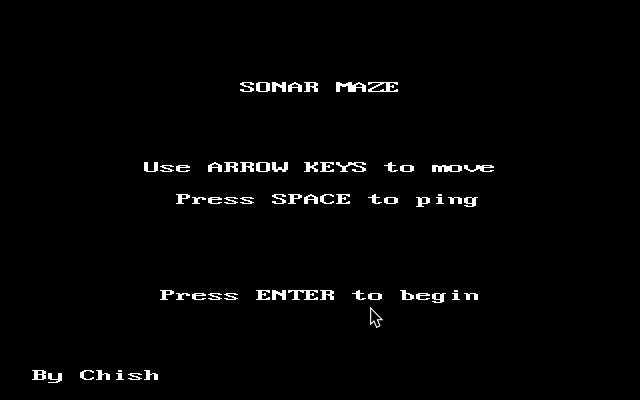

# The Sonar Maze

A maze game where you have to rely on sonar senses or you crash into depths of the sea.
Built with Rust for Siege Hackclub



## How To Play
- `ARROW KEYS` to move, `spacebar` to emit sonar
- The sonar would show you route for a moment
- Reach the exit before the fuel runs out!!
- If you crash the wall, well you might meet those billionares :D

You may press `TAB` to reveal whole level at once(only for debugging purposes)

PS: Nothing spooky in this game so dw

## So... where are grids??
Okay so, the game is 100% on a grid. But I thought it'd be more fun if the grid was **the actual enemy.**

It's totally invisible. Your only move is to 'ping' your sonar, which lights up the maze for a hot second.

The whole gameplay loop is just: **Ping. Memorize. Pray.**

It's less about moving on a grid and more about building one in your head. iykyk.

---

## Installation

### The Easy Way
Download binaries from [Releases](https://github.com/chishxd/sonar-maze/releases/tag/v.1.0.0)


### The Hard Way
1. Clone this repo
```git
git clone https://github.com/chishxd/sonar-maze.git
cd sonar-maze
```

2. Run the optimised build
```shell
cargo run --release
```

### Tech Stack
- **Language:** Rust
- **Engine/Library:** `bracket-lib`
- **World Generation:** Custom Rooms-and-Corridors with A*-based exit placement.``
